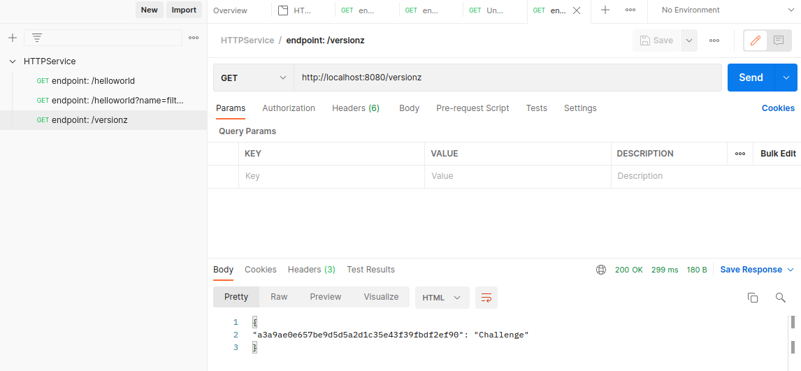

# Endocode_Challenge

This challenge consists of developing a HTTP service for returning specified strings according to the given HTTP endpoints, testing the service, deploying docker container, creating a CI/CD pipeline and deploying the service on kubernetes. 

## Dependencies

+ Python 
+ Python modules - requests
+ GitHub
+ Docker
+ Kubernetes (minikube and kubectl)

## Level 1

## Usage

Run the python HTTP service using the command in a terminal:

+ python HTTPService.py

Then in another terminal, running the command 'curl http://localhost:8080/helloworld' returns "Hello Stranger"

Running the command 'curl http://localhost:8080/helloworld?name=AlfredENeumann' returns "Hello
Alfred E Neumann" (camel-case gets cut by spaces)

Running the command 'curl http://localhost:8080/versionz' returns JSON with Git hash and name of the project.

Note: To access the git hash, personal access token has to be provided. Personal access token will be provided upon request.

## Make file

This is a utility for running the service through terminal.

Commands:

To start the server first in terminal:

+ make run_server

Then to access the endpoints in another terminal: 
In the third argument, specify the endpoint required i.e. helloworld or helloworld?name= or versionz

+ make hw
+ make hw_name
+ make version

## API testing with postman

The API has been tested with Postman successfully. An example response from Postman is shown below.

For the endpoint /versionz:

  

## Docker file

Run the following commands in the terminal to create the docker image and container.

+ docker build -t python-httpservice .
+ docker run python-httpservice

Save the docker image

+ docker save image_name:latest | gzip > myhttpimage_latest.tar.gz

